# AG-UI + A2A Multi-Agent Travel Planning Demo

## 项目愿景

这是一个展示Agent-to-Agent (A2A) 通信协议的多智能体协作演示项目。通过AG-UI协议和A2A中间件，展示了不同AI框架（Google ADK和LangGraph）之间的无缝协作能力，为用户提供智能旅行规划服务。

## 架构总览

项目采用分层架构，包含前端UI、A2A中间件、编排器层和专业化智能体层：

```mermaid
graph TD
    A["(根) AG-UI A2A Demo"] --> B["app/"];
    A --> C["agents/"];
    A --> D["components/"];
    A --> E["api/"];
    A --> F[".claude/"];

    B --> B1["layout.tsx"];
    B --> B2["page.tsx"];
    B --> B3["api/copilotkit/route.ts"];

    C --> C1["orchestrator.py"];
    C --> C2["itinerary_agent.py"];
    C --> C3["budget_agent.py"];
    C --> C4["restaurant_agent.py"];
    C --> C5["weather_agent.py"];
    C --> C6["requirements.txt"];

    D --> D1["travel-chat.tsx"];
    D --> D2["types/index.ts"];
    D --> D3["a2a/"];
    D --> D4["forms/"];
    D --> D5["hitl/"];

    E --> E1["orchestrator.py"];
    E --> E2["itinerary_agent.py"];
    E --> E3["budget_agent.py"];
    E --> E4["restaurant_agent.py"];
    E --> E5["weather_agent.py"];

    click B "./app/CLAUDE.md" "查看 Next.js Frontend 模块文档"
    click C "./agents/CLAUDE.md" "查看 Python Agents 模块文档"
    click D "./components/CLAUDE.md" "查看 UI Components 模块文档"
    click E "./api/CLAUDE.md" "查看 API Routes 模块文档"
```



### 技术栈
- **前端**: Next.js 15.1.6, React 19, TypeScript, Tailwind CSS, CopilotKit
- **后端智能体**: Google ADK (Gemini), LangGraph (OpenAI), FastAPI
- **协议**: AG-UI Protocol (Agent-UI通信), A2A Protocol (Agent间通信)
- **中间件**: @ag-ui/a2a-middleware

## 模块索引

| 模块 | 路径 | 语言/框架 | 职责 | 入口文件 |
|------|------|-----------|------|----------|
| **Python Agents** | `agents/` | Python + FastAPI | 多智能体后端，包含编排器和4个专业化智能体 | `orchestrator.py` |
| **Next.js Frontend** | `app/` | TypeScript/Next.js | 前端应用，包含主页面和API路由 | `page.tsx` |
| **UI Components** | `components/` | TypeScript/React | React组件库，包含聊天、表单、卡片等UI组件 | `travel-chat.tsx` |
| **API Routes** | `api/` | Python | Next.js API路由的Python智能体适配器 | `orchestrator.py` |

### 智能体详情

| 智能体 | 框架 | 端口 | 功能 | LLM模型 |
|--------|------|------|------|----------|
| Orchestrator | Google ADK | 9000 | 编排所有智能体，管理工作流 | Gemini 2.5 Pro |
| Itinerary Agent | LangGraph | 9001 | 创建行程计划 | OpenAI GPT |
| Budget Agent | Google ADK | 9002 | 预算估算 | Gemini |
| Restaurant Agent | LangGraph | 9003 | 餐厅推荐 | OpenAI GPT |
| Weather Agent | Google ADK | 9005 | 天气预报 | Gemini |

## 运行与开发

### 环境要求
- Node.js 18+
- Python 3.10+
- Google API Key (用于Gemini)
- OpenAI API Key (用于GPT)

### 快速启动
```bash
# 1. 安装前端依赖
npm install

# 2. 设置Python环境
cd agents
python -m venv .venv
source .venv/bin/activate  # Windows: .venv\\Scripts\\activate
pip install -r requirements.txt

# 3. 配置环境变量
cp .env.example .env
# 编辑.env添加API密钥

# 4. 启动所有服务
npm run dev
```

### 开发脚本
- `npm run dev:ui` - 启动Next.js开发服务器
- `npm run dev:orchestrator` - 启动编排器 (端口9000)
- `npm run dev:itinerary` - 启动行程智能体 (端口9001)
- `npm run dev:budget` - 启动预算智能体 (端口9002)
- `npm run dev:restaurant` - 启动餐厅智能体 (端口9003)
- `npm run dev:weather` - 启动天气智能体 (端口9005)
- `npm run build` - 构建生产版本
- `npm run start` - 启动生产服务器
- `npm run lint` - 运行ESLint

## 测试策略

项目目前缺少自动化测试，建议添加以下测试类型：
- **单元测试**: Python智能体核心逻辑测试
- **集成测试**: A2A通信协议测试
- **组件测试**: React组件的渲染和交互测试
- **端到端测试**: 完整旅行规划流程测试

## 编码规范

### TypeScript/React
- 使用TypeScript严格模式
- 遵循React函数组件和Hooks模式
- 使用Tailwind CSS进行样式设计
- 组件文件使用PascalCase命名

### Python
- 遵循PEP 8编码规范
- 使用类型提示 (Type Hints)
- 智能体使用异步FastAPI模式
- 环境变量通过python-dotenv管理

### 代码组织
- 智能体按功能分离到独立文件
- 共享类型定义集中在`components/types/index.ts`
- 配置文件放在相应模块根目录
- API路由保持一致性

## AI使用指引

### 智能体开发
- 新智能体应继承相应框架基类 (ADK或LangGraph)
- 暴露A2A Protocol端点以支持智能体间通信
- 返回结构化JSON数据以便前端解析
- 遵循单一职责原则，每个智能体专注特定功能

### A2A通信
- 所有智能体间通信通过A2A协议进行
- 编排器负责工作流管理和智能体协调
- 使用人类介入循环 (HITL) 进行关键决策点
- 实现错误处理和重试机制

### UI开发
- 使用CopilotKit进行AI-UI集成
- 组件支持结构化数据提取和渲染
- 实现实时消息流可视化
- 表单验证和状态管理

## 关键文件说明

- `app/api/copilotkit/route.ts` - A2A中间件配置，连接前端和智能体
- `agents/orchestrator.py` - 主编排器，协调整个工作流
- `components/travel-chat.tsx` - 主聊天组件，处理A2A消息可视化
- `components/types/index.ts` - 共享TypeScript类型定义
- `agents/requirements.txt` - Python依赖包清单

## 变更记录 (Changelog)

### 2025-11-15 00:42:19
- 初始化AI上下文文档
- 完成项目架构分析和模块划分
- 创建根级和模块级CLAUDE.md文档
- 生成.claude/index.json扫描索引

---

*此文档由AI自动生成，如有不准确之处请手动修正*