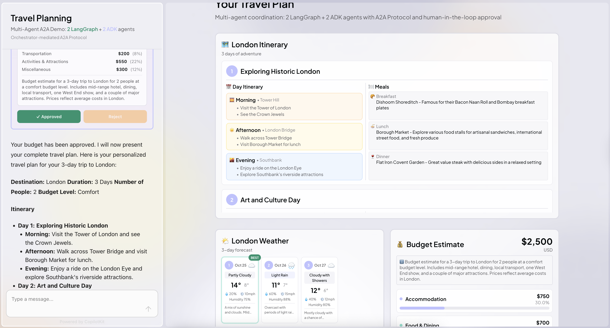

# AG-UI + A2A Multi-Agent Communication Demo

A demonstration of Agent-to-Agent (A2A) communication between different AI agent frameworks using the AG-UI Protocol and A2A Middleware.



## Quick Start

### Prerequisites

- Node.js 18+
- Python 3.10+
- [Google API Key](https://aistudio.google.com/app/apikey)
- [OpenAI API Key](https://platform.openai.com/api-keys)

### Setup

1. Install frontend dependencies:

```bash
npm install
```

2. Install Python dependencies:

```bash
cd agents
python -m venv .venv
source .venv/bin/activate  # On Windows: .venv\Scripts\activate
pip install -r requirements.txt
```

3. Configure environment variables:

```bash
cp .env.example .env
# Edit .env and add your GOOGLE_API_KEY and OPENAI_API_KEY
```

4. Start all services:

```bash
npm run dev
```

This starts:

- UI on `http://localhost:3000`
- Orchestrator on `http://localhost:9000`
- Itinerary Agent on `http://localhost:9001`
- Budget Agent on `http://localhost:9002`
- Restaurant Agent on `http://localhost:9003`
- Weather Agent on `http://localhost:9005`

## Usage

Try asking: "Plan a 3-day trip to Tokyo" or "I want to visit New York for 5 days"

The orchestrator will coordinate the agents to:

1. Collect trip requirements (destination, days, people, budget level)
2. Generate an itinerary
3. Provide weather forecast
4. Recommend restaurants for each day
5. Estimate budget and request approval

Agent interactions are visible in the UI with message flow visualization.

## What This Demonstrates

This demo shows how specialized agents built with different frameworks can communicate via the A2A protocol:

### LangGraph Agents (Python + OpenAI)

- **Itinerary Agent** (Port 9001) - Creates day-by-day travel itineraries
- **Restaurant Agent** (Port 9003) - Recommends meal plans

### ADK Agents (Python + Gemini)

- **Budget Agent** (Port 9002) - Estimates travel costs
- **Weather Agent** (Port 9005) - Provides weather forecasts

### Orchestrator

- **Orchestrator Agent** (Port 9000) - Coordinates all agents via A2A middleware

The demo includes multi-framework integration, structured JSON outputs, generative UI components, human-in-the-loop workflows, and real-time message visualization

## Architecture

```
┌──────────────────────────────────────────┐
│ Next.js UI (CopilotKit)                  │
└────────────┬─────────────────────────────┘
             │ AG-UI Protocol
┌────────────┴─────────────────────────────┐
│ A2A Middleware                            │
│ - Routes messages between agents          │
└──────┬───────────────────────────────────┘
       │ A2A Protocol
       │
       ├─────► LangGraph Agents (OpenAI)
       │       ├── Itinerary (9001)
       │       └── Restaurant (9003)
       │
       └─────► ADK Agents (Gemini)
               ├── Budget (9002)
               └── Weather (9005)
       ▲
       │
┌──────┴──────────┐
│ Orchestrator    │
│ (Port 9000)     │
└─────────────────┘
```

## Project Structure

```
ag-ui-a2a-demo/
├── app/
│   ├── api/copilotkit/route.ts       # A2A middleware setup
│   └── page.tsx                      # Main UI
│
├── components/
│   ├── a2a/                          # A2A message components
│   ├── travel-chat.tsx               # Chat orchestration
│   └── [other UI components]
│
├── agents/                           # Python agents
│   ├── orchestrator.py               # Orchestrator (9000)
│   ├── itinerary_agent.py            # LangGraph (9001)
│   ├── budget_agent.py               # ADK (9002)
│   ├── restaurant_agent.py           # LangGraph (9003)
│   └── weather_agent.py              # ADK (9005)
│
└── .env.example
```

## Technologies

- **Frontend**: Next.js, CopilotKit, AG-UI Client, Tailwind CSS
- **Backend**: Google ADK (Gemini), LangGraph (OpenAI), FastAPI
- **Protocols**: A2A (agent-to-agent), AG-UI (agent-UI)
- **Middleware**: @ag-ui/a2a-middleware

## Troubleshooting

**Agents not connecting?**
Verify all services are running by checking `http://localhost:9000-9005`

**Missing API keys?**
Ensure `.env` contains `GOOGLE_API_KEY` and `OPENAI_API_KEY`

**Python issues?**
Activate the virtual environment: `cd agents && source .venv/bin/activate`

## Learn More

- [AG-UI Protocol](https://docs.ag-ui.com)
- [A2A Protocol](https://github.com/agent-matrix/a2a)
- [Google ADK](https://google.github.io/adk-docs/)
- [LangGraph](https://langchain-ai.github.io/langgraph/)
- [CopilotKit](https://docs.copilotkit.ai)

## License

MIT
